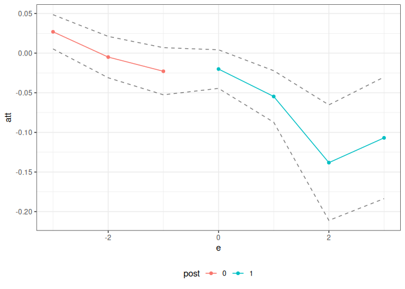

<!-- README.md is generated from README.Rmd. Please edit that file -->

# Panel Treatment Effects Tools (ptetools) Package 

## Structure of panel data causal inference problems

The `ptetools` package compartmentalizes the steps needed to implement
estimators of group-time average treatment effects (and their
aggregations) in order to make it easier to apply the same sorts of
arguments outside of their “birthplace” in the literature on
difference-in-differences.

Essentially, the idea is that many panel data causal inference problems
involve steps such as:

1.  Defining an identification strategy (e.g.,
    difference-in-differences)

2.  Defining a notion of a group (e.g., based on treatment timing)

3.  Looping over groups and time periods

4.  Organizing the data so that the correct data show up for each group
    and time period

5.  Computing group-time average treatment effects (or other parameters
    that are local to a group and a time period)

6.  Aggregating group-time average treatment effect parameters (e.g.,
    into an event study or an overall average treatment effect
    parameter)

Many of these steps are common across different panel data causal
inference settings. For example, you could implement a
difference-in-differences identification strategy or a change-in-changes
identification strategy with all of the same steps as above except for
replacing step 1.

The idea of the `ptetools` package is to re-use as much
code/infrastructure as possible when developing new approaches to panel
data causal inference. For example, `ptetools` sits as the “backend” for
several other packages including: `ife`, `contdid`, and parts of `qte`.

## How ptetools works

The main function is called `pte`. The most important parameters that it
takes in are `subset_fun` and `attgt_fun`. These are functions that the
user should pass to `pte`.

`subset_fun` takes in the overall data, a group, a time period, and
possibly other arguments and returns a `data.frame` containing the
relevant subset of the data, an outcome, and whether or not a unit
should be considered to be in the treated or comparison group for that
group/time. There is one example of a relevant subset function provided
in the package: [the `two_by_two_subset`
function](https://github.com/bcallaway11/ptetools/blob/master/R/subset_functions.R).
This function takes an original dataset, subsets it into pre- and
post-treatment periods and denotes treated and untreated units. This
particular subset is perhaps the most common/important one for thinking
about treatment effects with panel data, and this function can be reused
across applications.

The other main function is `attgt_fun`. This function should be able to
take in the correct subset of data, possibly along with other arguments
to the function, and report an *ATT* for that subset. With minor
modification, this function should be availble for most any sort of
treatment effects application — for example, if you can solve the
baseline 2x2 case in difference in differences, you should use that
function here, and the `ptetools` package will take care of dealing with
the variation in treatment timing.

If `attgt_fun` returns an influence function, then the `ptetools`
package will also conduct inference using the multiplier bootstrap
(which is fast) and produce uniform confidence bands (which adjust for
multiple testing).

The default output of `pte` is an overall treatment effect on the
treated (i.e., across all groups that participate in the treatment in
any time period) and and event study. More aggregations are possible,
but these seem to be the leading cases; aggregations of group-time
average treatment effects are discussed at length in [Callaway and
Sant’Anna (2021)](https://doi.org/10.1016/j.jeconom.2020.12.001).

Below are several examples of how the `ptetools` package can be used to
implement an identification strategy with a very small amount of new
code.

## Example 1: Difference in differences

The [`did` package](https://bcallaway11.github.io/did/), which is based
on [Callaway and Sant’Anna
(2021)](https://doi.org/10.1016/j.jeconom.2020.12.001), includes
estimates of group-time average treatment effects, *ATT(g,t)*, based on
a difference in differences identification strategy. The following
example demonstrates that it is easy to compute group-time average
treatment effects using difference in differences using the `ptetools`
package. \[*Note:* This is definitely not the recommended way of doing
this as there is very little error handling, etc. here, but it is rather
a proof of concept. You should use the `did` package for this case.\]

This example reproduces DID estimates of the effect of the minimum wage
on employment using data from the `did` package.

``` r
library(did)
data(mpdta)
did_res <- pte(
  yname = "lemp",
  gname = "first.treat",
  tname = "year",
  idname = "countyreal",
  data = mpdta,
  setup_pte_fun = setup_pte,
  subset_fun = two_by_two_subset,
  attgt_fun = did_attgt,
  xformla = ~lpop
)

summary(did_res)
#> 
#> Overall ATT:  
#>      ATT    Std. Error     [ 95%  Conf. Int.]  
#>  -0.0305        0.0139    -0.0577     -0.0033 *
#> 
#> 
#> Dynamic Effects:
#>  Event Time Estimate Std. Error   [95%  Conf. Band]  
#>          -3   0.0298     0.0128 -0.0016      0.0612  
#>          -2  -0.0024     0.0124 -0.0330      0.0281  
#>          -1  -0.0243     0.0156 -0.0625      0.0140  
#>           0  -0.0189     0.0121 -0.0486      0.0108  
#>           1  -0.0536     0.0209 -0.1049     -0.0022 *
#>           2  -0.1363     0.0421 -0.2394     -0.0332 *
#>           3  -0.1008     0.0290 -0.1719     -0.0297 *
#> ---
#> Signif. codes: `*' confidence band does not cover 0
ggpte(did_res)
```

<!-- -->

What’s most interesting here, is that the only “new” code that needs to
be writte is in [the `did_attgt`
function](https://github.com/bcallaway11/ptetools/blob/master/R/attgt_functions.R).
You will see that this is a very small amount of code.

## Example 2: Policy Evaluation during a Pandemic

As a next example, consider trying to estimate effects of Covid-19
related policies during a pandemic. The estimates below are for the
effects of state-leve shelter-in-place orders during the early part of
the pandemic.

The data for this example comes from the `ppe` package which can be
loaded by running

``` r
devtools::install_github("bcallaway11/ppe")
library(ppe)
data(covid_data)
```

[Callaway and Li (2021)](https://arxiv.org/abs/2105.06927) argue that a
particular unconfoundedness-type strategy is more appropriate in this
context than DID-type strategies due to the spread of Covid-19 cases
being highly nonlinear. However, they still deal with the challenge of
variation in treatment timing. Therefore, it is still useful to think
about group-time average treatment effects, but the DID strategy should
be replaced with their particular unconfoundedness type assumption.

The `ptetools` package is particularly useful here.

``` r
# formula for covariates
xformla <- ~ current + I(current^2) + region + totalTestResults
```

``` r
covid_res <- pte(
  yname = "positive",
  gname = "group",
  tname = "time.period",
  idname = "state_id",
  data = covid_data2,
  setup_pte_fun = setup_pte_basic,
  subset_fun = two_by_two_subset,
  attgt_fun = covid_attgt,
  xformla = xformla,
  max_e = 21,
  min_e = -10
)

summary(covid_res)
#> 
#> Overall ATT:  
#>      ATT    Std. Error     [ 95%  Conf. Int.] 
#>  14.8882       81.3975   -144.648    174.4243 
#> 
#> 
#> Dynamic Effects:
#>  Event Time Estimate Std. Error     [95%  Conf. Band] 
#>         -10  -3.7266     4.0770  -14.5913      7.1380 
#>          -9   2.6607     1.3233   -0.8659      6.1872 
#>          -8   0.8290     2.0592   -4.6584      6.3164 
#>          -7   5.2843     2.3890   -1.0820     11.6507 
#>          -6   2.8555     1.9429   -2.3220      8.0330 
#>          -5   1.3589     3.8561   -8.9169     11.6348 
#>          -4   0.3294     4.1641  -10.7672     11.4260 
#>          -3  -4.2227     4.5687  -16.3976      7.9523 
#>          -2  -3.8447     2.5874  -10.7397      3.0502 
#>          -1  -0.2234     3.5748   -9.7498      9.3030 
#>           0 -10.8156     8.4284  -33.2760     11.6448 
#>           1 -13.7998    12.7000  -47.6435     20.0439 
#>           2  -7.8432    10.3881  -35.5260     19.8397 
#>           3  -4.5541    11.5720  -35.3918     26.2835 
#>           4  -3.5368    12.8737  -37.8435     30.7698 
#>           5   8.5221    12.5426  -24.9021     41.9463 
#>           6   1.1140    19.6653  -51.2911     53.5191 
#>           7   6.6384    22.1615  -52.4189     65.6958 
#>           8   7.1288    24.7498  -58.8259     73.0835 
#>           9  10.8758    30.0144  -69.1082     90.8598 
#>          10  17.5057    38.3232  -84.6201    119.6315 
#>          11  40.8318    35.9062  -54.8530    136.5165 
#>          12  48.6134    49.4014  -83.0342    180.2609 
#>          13  52.4228    52.3941  -87.1999    192.0455 
#>          14  50.2000    65.3084 -123.8374    224.2375 
#>          15  68.2960    56.4158  -82.0440    218.6360 
#>          16  44.7305    64.0967 -126.0780    215.5390 
#>          17  61.4670    89.4620 -176.9366    299.8705 
#>          18  50.4635    86.2362 -179.3437    280.2707 
#>          19  47.3392   123.0495 -280.5702    375.2485 
#>          20  28.6326   120.9462 -293.6718    350.9370 
#>          21   4.3445   145.9722 -384.6504    393.3395 
#> ---
#> Signif. codes: `*' confidence band does not cover 0
ggpte(covid_res) + ylim(c(-1000, 1000))
```

<!-- -->

What’s most interesting is just how little code needs to be written
here. The only new code required is the `ppe::covid_attgt` function
which is [available
here](https://github.com/bcallaway11/ppe/blob/master/R/covid_attgt.R),
and, as you can see, this is very simple.

## Example 3: Empirical Bootstrap

The code above used the multiplier bootstrap. The great thing about the
multiplier bootstrap is that it’s fast. But in order to use it, you have
to work out the influence function for the estimator of *ATT(g,t)*.
Although I pretty much always end up doing this, it can be tedious, and
it can be nice to get a working version of the code for a project going
before working out the details on the influence function.

The `ptetools` package can be used with the empirical bootstrap. There
are a few limitations. First, it’s going to be substantially slower.
Second, this code just reports pointwise confidence intervals. However,
this basically is set up to fit into my typical workflow, and I see this
as a way to get preliminary results.

Let’s demonstrate it. To do this, consider the same setup as in Example
1, but where no influence function is returned. Let’s write the code for
this:

``` r
# did with no influence function
did_attgt_noif <- function(gt_data, xformla, ...) {
  # call original function
  did_gt <- did_attgt(gt_data, xformla, ...)

  # remove influence function
  did_gt$inf_func <- NULL

  did_gt
}
```

Now, we can show the same sorts of results as above

``` r
did_res_noif <- pte(
  yname = "lemp",
  gname = "first.treat",
  tname = "year",
  idname = "countyreal",
  data = mpdta,
  setup_pte_fun = setup_pte,
  subset_fun = two_by_two_subset,
  attgt_fun = did_attgt_noif, # this is only diff.
  xformla = ~lpop
)

summary(did_res_noif)
#> 
#> Overall ATT:  
#>      ATT    Std. Error     [ 95%  Conf. Int.]  
#>  -0.0323        0.0128    -0.0574     -0.0072 *
#> 
#> 
#> Dynamic Effects:
#>  Event Time Estimate Std. Error [95% Pointwise  Conf. Band]  
#>          -3   0.0269     0.0137          0.0000      0.0539 *
#>          -2  -0.0050     0.0130         -0.0304      0.0204  
#>          -1  -0.0229     0.0133         -0.0490      0.0032  
#>           0  -0.0201     0.0123         -0.0442      0.0039  
#>           1  -0.0547     0.0188         -0.0915     -0.0179 *
#>           2  -0.1382     0.0356         -0.2080     -0.0684 *
#>           3  -0.1069     0.0336         -0.1727     -0.0411 *
#> ---
#> Signif. codes: `*' confidence band does not cover 0
ggpte(did_res_noif)
```

<!-- -->

What’s exciting about this is just how little new code needs to be
written.
