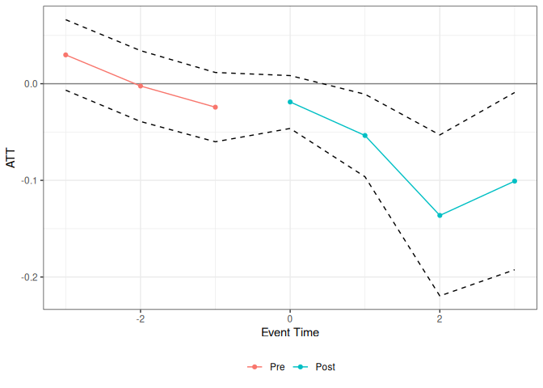
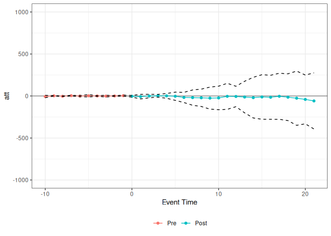
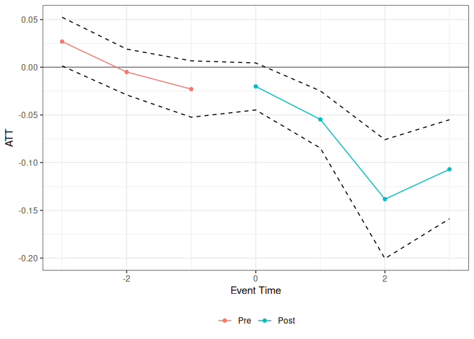

# Panel Treatment Effects Tools (ptetools) Package

## Structure of panel data causal inference problems

The `ptetools` package compartmentalizes the steps needed to implement
estimators of group-time average treatment effects (and their
aggregations) in order to make it easier to apply the same sorts of
arguments outside of their “birthplace” in the literature on
difference-in-differences.

Essentially, the idea is that many panel data causal inference problems
involve steps such as:

1.  Defining an identification strategy (e.g.,
    difference-in-differences)

2.  Defining a notion of a group (e.g., based on treatment timing)

3.  Looping over groups and time periods

4.  Organizing the data so that the correct data show up for each group
    and time period

5.  Computing group-time average treatment effects (or other parameters
    that are local to a group and a time period)

6.  Aggregating group-time average treatment effect parameters (e.g.,
    into an event study or an overall average treatment effect
    parameter)

Many of these steps are common across different panel data causal
inference settings. For example, you could implement a
difference-in-differences identification strategy or a change-in-changes
identification strategy with all of the same steps as above except for
replacing step 1.

The idea of the `ptetools` package is to re-use as much
code/infrastructure as possible when developing new approaches to panel
data causal inference. For example, `ptetools` sits as the “backend” for
several other packages including: `ife`, `contdid`, and parts of `qte`.

## How ptetools works

The main function is called `pte`. The most important parameters that it
takes in are `subset_fun` and `attgt_fun`. These are functions that the
user should pass to `pte`.

`subset_fun` takes in the overall data, a group, a time period, and
possibly other arguments and returns a `data.frame` containing the
relevant subset of the data, an outcome, and whether or not a unit
should be considered to be in the treated or comparison group for that
group/time. There is one example of a relevant subset function provided
in the package: [the `two_by_two_subset`
function](https://github.com/bcallaway11/ptetools/blob/master/R/subset_functions.R).
This function takes an original dataset, subsets it into pre- and
post-treatment periods and denotes treated and untreated units. This
particular subset is perhaps the most common/important one for thinking
about treatment effects with panel data, and this function can be reused
across applications.

The other main function is `attgt_fun`. This function should be able to
take in the correct subset of data, possibly along with other arguments
to the function, and report an *ATT* for that subset. With minor
modification, this function should be available for most any sort of
treatment effects application — for example, if you can solve the
baseline 2x2 case in difference in differences, you should use that
function here, and the `ptetools` package will take care of dealing with
the variation in treatment timing.

If `attgt_fun` returns an influence function, then the `ptetools`
package will also conduct inference using the multiplier bootstrap
(which is fast) and produce uniform confidence bands (which adjust for
multiple testing).

The default output of `pte` is an overall treatment effect on the
treated (i.e., across all groups that participate in the treatment in
any time period) and and event study. More aggregations are possible,
but these seem to be the leading cases; aggregations of group-time
average treatment effects are discussed at length in [Callaway and
Sant’Anna (2021)](https://doi.org/10.1016/j.jeconom.2020.12.001).

Below are several examples of how the `ptetools` package can be used to
implement an identification strategy with a very small amount of new
code.

## Example 1: Difference in differences

The [`did` package](https://bcallaway11.github.io/did/), which is based
on [Callaway and Sant’Anna
(2021)](https://doi.org/10.1016/j.jeconom.2020.12.001), includes
estimates of group-time average treatment effects, *ATT(g,t)*, based on
a difference in differences identification strategy. The following
example demonstrates that it is easy to compute group-time average
treatment effects using difference in differences using the `ptetools`
package. \[*Note:* This is definitely not the recommended way of doing
this as there is very little error handling, etc. here, but it is rather
a proof of concept. You should use the `did` package for this case.\]

This example reproduces DID estimates of the effect of the minimum wage
on employment using data from the `did` package.

``` r
library(did)
data(mpdta)
did_res <- pte(
  yname = "lemp",
  gname = "first.treat",
  tname = "year",
  idname = "countyreal",
  data = mpdta,
  setup_pte_fun = setup_pte,
  subset_fun = two_by_two_subset,
  attgt_fun = did_attgt,
  xformla = ~lpop
)

summary(did_res)
#> 
#> Overall ATT:  
#>      ATT    Std. Error     [ 95%  Conf. Int.] 
#>  -0.0305        0.0179    -0.0655      0.0046 
#> 
#> 
#> Dynamic Effects:
#>  Event Time Estimate Std. Error [95% Simult.  Conf. Band]  
#>          -3   0.0298     0.0144       -0.0067      0.0662  
#>          -2  -0.0024     0.0145       -0.0391      0.0342  
#>          -1  -0.0243     0.0142       -0.0601      0.0116  
#>           0  -0.0189     0.0108       -0.0463      0.0084  
#>           1  -0.0536     0.0169       -0.0963     -0.0109 *
#>           2  -0.1363     0.0330       -0.2196     -0.0530 *
#>           3  -0.1008     0.0363       -0.1925     -0.0091 *
#> ---
#> Signif. codes: `*' confidence band does not cover 0
ggplot2::autoplot(did_res)
```



What’s most interesting here, is that the only “new” code that needs to
be written is in [the `did_attgt`
function](https://github.com/bcallaway11/ptetools/blob/master/R/attgt_functions.R).
You will see that this is a very small amount of code.

## Example 2: Policy Evaluation during a Pandemic

As a next example, consider trying to estimate effects of COVID-19
related policies during a pandemic. The estimates below are for the
effects of state-level shelter-in-place orders during the early part of
the pandemic.

The data for this example is included in the `ptetools` package:

``` r
data(covid_data)
```

[Callaway and Li (2021)](https://arxiv.org/abs/2105.06927) argue that a
particular unconfoundedness-type strategy is more appropriate in this
context than DID-type strategies due to the spread of COVID-19 cases
being highly nonlinear. However, they still deal with the challenge of
variation in treatment timing. Therefore, it is still useful to think
about group-time average treatment effects, but the DID strategy should
be replaced with their particular unconfoundedness type assumption.

The `ptetools` package handles this through `pte_default` with
`lagged_outcome_cov = TRUE`.

``` r
# formula for covariates
xformla <- ~ current + I(current^2) + region + totalTestResults
```

``` r
covid_res <- pte_default(
  yname = "positive",
  gname = "group",
  tname = "time.period",
  idname = "state_id",
  data = covid_data2,
  xformula = xformla,
  d_outcome = FALSE,
  lagged_outcome_cov = TRUE,
  max_e = 21,
  min_e = -10
)

summary(covid_res)
#> 
#> Overall ATT:  
#>       ATT    Std. Error     [ 95%  Conf. Int.] 
#>  -13.2547       68.2125  -146.9487    120.4393 
#> 
#> 
#> Dynamic Effects:
#>  Event Time Estimate Std. Error [95% Simult.  Conf. Band] 
#>         -10  -6.3170     5.8206      -20.7487      8.1148 
#>          -9   2.1087     1.0787       -0.5659      4.7834 
#>          -8  -2.7721     1.1642       -5.6587      0.1144 
#>          -7   3.8965     1.7664       -0.4831      8.2761 
#>          -6  -1.0588     2.6137       -7.5393      5.4217 
#>          -5   2.4337     5.7723      -11.8782     16.7456 
#>          -4   0.2436     1.3876       -3.1970      3.6841 
#>          -3  -1.3052     4.3062      -11.9821      9.3717 
#>          -2   0.4594     1.3834       -2.9705      3.8894 
#>          -1   4.0376     2.7897       -2.8794     10.9545 
#>           0  -3.2518     3.9590      -13.0678      6.5643 
#>           1  -7.4231    10.9962      -34.6873     19.8411 
#>           2  -0.3148     8.3794      -21.0910     20.4613 
#>           3   2.7880     6.6221      -13.6309     19.2070 
#>           4   1.3625    11.4217      -26.9568     29.6818 
#>           5  -2.9563    19.7428      -51.9074     45.9947 
#>           6 -17.2610    24.4538      -77.8925     43.3705 
#>           7 -19.2258    36.7338     -110.3048     71.8531 
#>           8 -21.5150    41.6608     -124.8102     81.7803 
#>           9 -25.2793    52.8104     -156.2191    105.6605 
#>          10 -23.0541    56.4574     -163.0364    116.9282 
#>          11  -3.8346    62.5346     -158.8848    151.2156 
#>          12  -5.6789    48.9659     -127.0865    115.7287 
#>          13 -12.4977    75.7291     -200.2630    175.2675 
#>          14 -19.6199    97.6364     -261.7026    222.4629 
#>          15 -11.6638   106.8833     -276.6738    253.3462 
#>          16 -15.0522   105.6627     -277.0357    246.9313 
#>          17  -3.3234   110.5480     -277.4196    270.7728 
#>          18 -14.3328   112.3203     -292.8233    264.1577 
#>          19 -26.1852   130.2347     -349.0934    296.7230 
#>          20 -40.7039   117.1056     -331.0591    249.6514 
#>          21 -58.7364   134.7157     -392.7549    275.2821 
#> ---
#> Signif. codes: `*' confidence band does not cover 0
ggplot2::autoplot(covid_res) + ylim(c(-1000, 1000))
```



What’s most interesting is just how little code needs to be written
here. The `pte_default` function handles the unconfoundedness-type
identification strategy directly, with no custom `attgt_fun` required.

## Example 3: Empirical Bootstrap

The code above used the multiplier bootstrap. The great thing about the
multiplier bootstrap is that it’s fast. But in order to use it, you have
to work out the influence function for the estimator of *ATT(g,t)*.
Although I pretty much always end up doing this, it can be tedious, and
it can be nice to get a working version of the code for a project going
before working out the details on the influence function.

The `ptetools` package can be used with the empirical bootstrap. There
are a few limitations. First, it’s going to be substantially slower.
Second, this code just reports pointwise confidence intervals. However,
this basically is set up to fit into my typical workflow, and I see this
as a way to get preliminary results.

Let’s demonstrate it. To do this, consider the same setup as in Example
1, but where no influence function is returned. Let’s write the code for
this:

``` r
# did with no influence function
did_attgt_noif <- function(gt_data, xformla, ...) {
  # call original function
  did_gt <- did_attgt(gt_data, xformla, ...)

  # remove influence function
  did_gt$inf_func <- NULL

  did_gt
}
```

Now, we can show the same sorts of results as above

``` r
did_res_noif <- pte(
  yname = "lemp",
  gname = "first.treat",
  tname = "year",
  idname = "countyreal",
  data = mpdta,
  setup_pte_fun = setup_pte,
  subset_fun = two_by_two_subset,
  attgt_fun = did_attgt_noif, # this is only diff.
  xformla = ~lpop
)

summary(did_res_noif)
#> 
#> Overall ATT:  
#>      ATT    Std. Error     [ 95%  Conf. Int.]  
#>  -0.0323        0.0127    -0.0557     -0.0088 *
#> 
#> 
#> Dynamic Effects:
#>  Event Time Estimate Std. Error [95% Simult.  Conf. Band]  
#>          -3   0.0269     0.0130        0.0014      0.0524 *
#>          -2  -0.0050     0.0122       -0.0290      0.0190  
#>          -1  -0.0229     0.0151       -0.0524      0.0067  
#>           0  -0.0201     0.0126       -0.0448      0.0045  
#>           1  -0.0547     0.0153       -0.0847     -0.0248 *
#>           2  -0.1382     0.0318       -0.2005     -0.0759 *
#>           3  -0.1069     0.0265       -0.1588     -0.0550 *
#> ---
#> Signif. codes: `*' confidence band does not cover 0
ggplot2::autoplot(did_res_noif)
```



What’s exciting about this is just how little new code needs to be
written.
